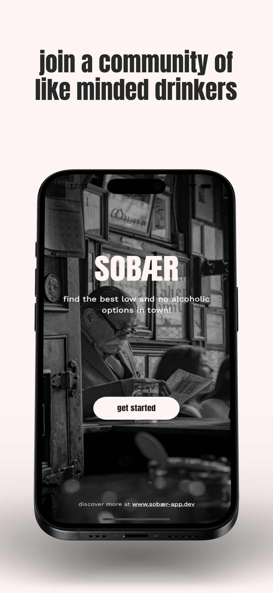
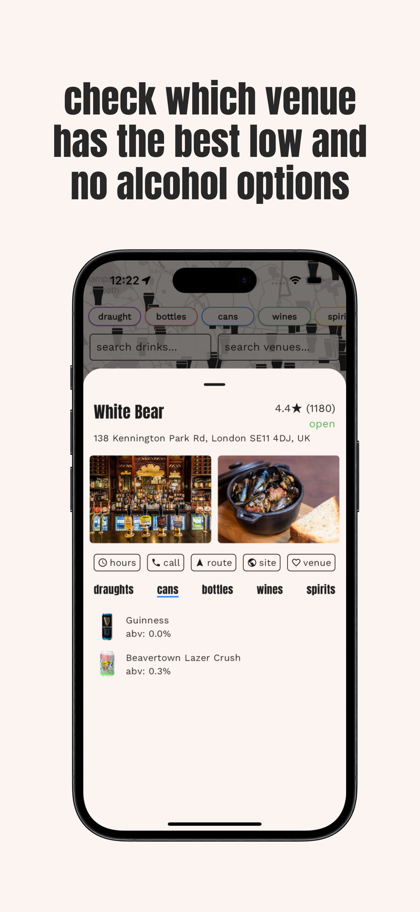

# Sobaer App

An app to search London's pubs for no and low alcohol drinks.

## Screen Shots

  

  

  

  

## Tech Stack

- **Flutter Framework**: Used to build the UI and manage the app’s architecture.
- **Firebase**: For database management and user authentication.
- **Google Cloud Functions**: To securely store and manage environment variables.