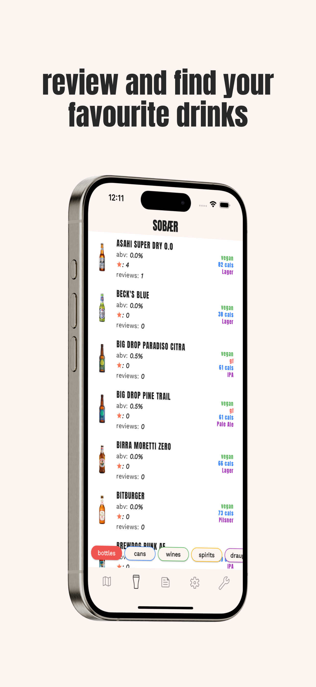

# Sobaer App

An app to search London's pubs for no and low alcohol drinks.

## Screen Shots

*App home screen showing pub search functionality.*

*Drinks list search page*

*Apps welcome screen*

*App venue meta data page*

## Tech Stack

- **Flutter Framework**: Used to build the UI and manage the app’s architecture.
- **Firebase**: For database management and user authentication.
- **Google Cloud Functions**: To securely store and manage environment variables.